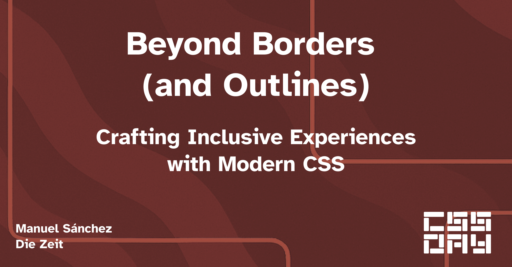

# CSS Day

[Repo](https://github.com/manuelsanchez2/cssday-2025-a11y)
|
[Live Link](https://cssday-2025.manuelsanchezdev.com/)

## Topics 

This repository is part of the lightning talk taking place on the CSS Day 2025 about **Crafting Inclusive Experiences with Modern CSS**
I discussed mainly how to:

- [Debug things with just CSS as an alternative to some automatic tools](/styles/debug.css)
- [How to implement smart contrast colors in your projects](/styles/contrast.css)

---

## 📦 Bonus: Now a standalone library!

Thanks to the feedback I received after the talk, I decided to turn the debugging stylesheet into a proper, reusable library.

➡️ Find it here:  
**[a11y-debug-stylesheet → GitHub Repo](https://github.com/manuelsanchez2/a11y-debug-stylesheet)**

Use it in your own projects to visually highlight common accessibility issues using only CSS – no JavaScript, no build step, just drop it in.